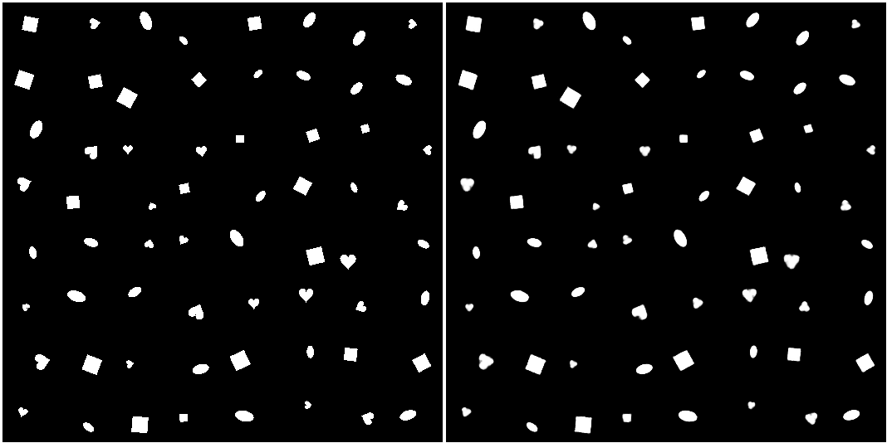

# β-VAE
Codebase builds upon [WonKwang Lee and Tony Metger] [1] , where I introduce key improvements for usability, reproducibility, and performance:

### My Contributions
```markdown

|------ Dataset Management
|              |---- Integrated scripts to automatically download datasets (3DChairs and CelebA)
                      with a single command.

|------ New Features and bug fixes
|              |---- Fixed a bug related to ploting the posterior mean.
|              |---- Updated the plot gif method to use `imageio` insteaf of `grid2gif` to 
                      enhance scalability of the codebase.

|------ Code Compatibility and Optimization
|              |---- Updated the codebase to be compatible with the latest version of PyTorch,
                      enhancing scalability and performance.
|              |---- Refactored the code to remove unnecessary methods and ensure smooth execution
                      regardless of the working directory from which `main.py` is called.

|------ GPU Selection
|              |---- Enabled GPU selection to allow running experiments on specified GPUs,
                      providing flexibility for multi-GPU environments.

|------ Project Organization
|              |---- Created a dedicated `scripts/` directory to streamline the setup
                      and execution of experiments.
|              |---- Added a `requirements.txt` file that includes all project dependencies
                      for easy environment setup.

|------ Documentation and Reproducibility
|              |---- Developed detailed documentation on how to set up the environment
                      and reproduce experimental results.
```


Pytorch reproduction of two papers below:
1. [β-VAE: Learning Basic Visual Concepts with a Constrained Variational Framework, Higgins et al., ICLR, 2017] [2]
2.  [Understanding disentangling in β-VAE, Burgess et al., arxiv:1804.03599, 2018] [3]
<br>

## Getting Started 

#### Clone the repository

```bash
git clone https://github.com/lesupermomo/B-VAE.git
```

#### Create a Virtual Environment
Create a virtual environment to isolate your project dependencies.

```bash
python3 -m venv venv
```

#### Activate the Virtual Environment

```bash
source venv/bin/activate
```

#### Install the Required Dependencies

```bash
pip install -r requirements.txt
```

#### Download the Dataset
Run one of the following commands to download a dataset:

```bash
./scripts/prepare_data.sh 3DChairs
./scripts/prepare_data.sh dsprites
./scripts/prepare_data.sh CelebA
```

#### Start a visdom session to monitor results

```bash
python -m visdom.server
```
The experiments plots and results will be at http://localhost:8097/.

#### Run the Experiment

```bash
./scripts/run_dsprites_B_gamma100_z10.sh
```
This will initiate the experiment with the specified parameters.

## Results

#### dSprites
```
./scripts/run_dsprites_B_gamma100_z10.sh
```

| Reconstruction Loss - KL Divergence - Posterior Variance |
|-----------------------------|
| <p align="center"></p> |

| latent traversal |
|-----------------------------|
| <p align="center">  </p>|


| Input Image vs Reconstruction |
|-----------------------------|
| <p align="center"></p> |


#### 3D Chairs
```
./scripts/run_3dchairs_H_beta4_z10.sh
```

| latent traversal |
|-----------------------------|
| <p align="center"> </p> |


#### CelebA
```
./scripts/run_celeba_H_beta10_z10.sh
```
| latent traversal |
|-----------------------------|
| <p align="center"> </p> |


### Reference
1. [WonKwang Lee and Tony Metger]
2. [β-VAE: Learning Basic Visual Concepts with a Constrained Variational Framework, Higgins et al., ICLR, 2017]
3. [Understanding disentangling in β-VAE, Burgess et al., arxiv:1804.03599, 2018]


[β-VAE: Learning Basic Visual Concepts with a Constrained Variational Framework, Higgins et al., ICLR, 2017]: https://openreview.net/pdf?id=Sy2fzU9gl
[Understanding disentangling in β-VAE, Burgess et al., arxiv:1804.03599, 2018]: http://arxiv.org/abs/1804.03599
[WonKwang Lee and Tony Metger]: https://github.com/1Konny/Beta-VAE?tab=readme-ov-file
