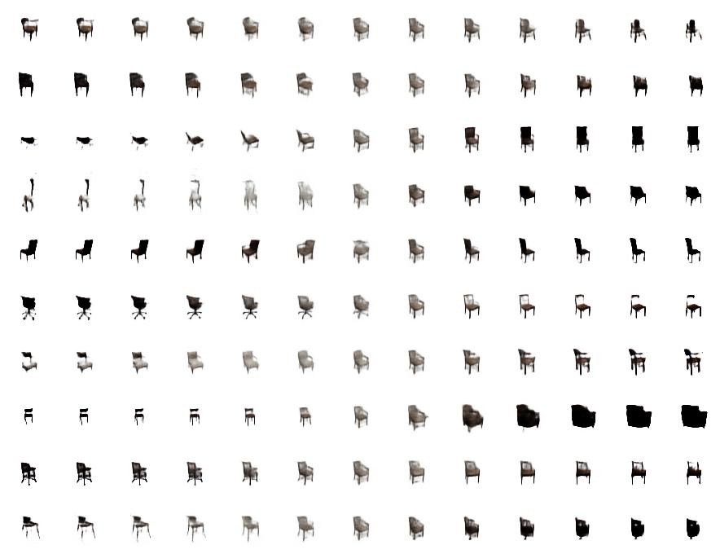
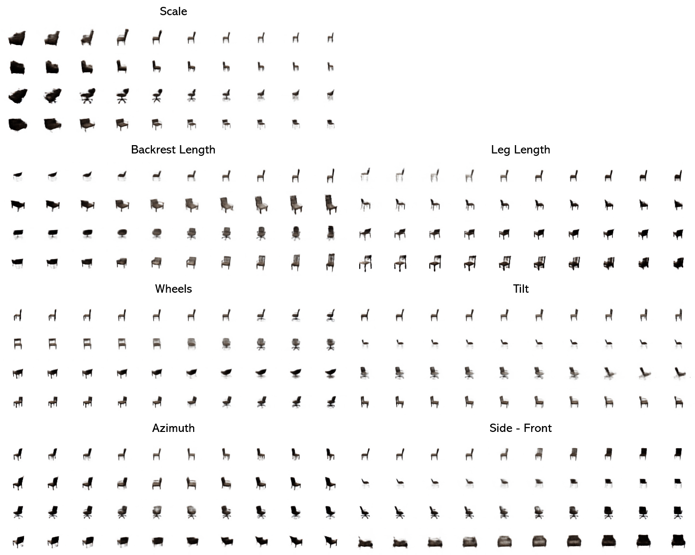
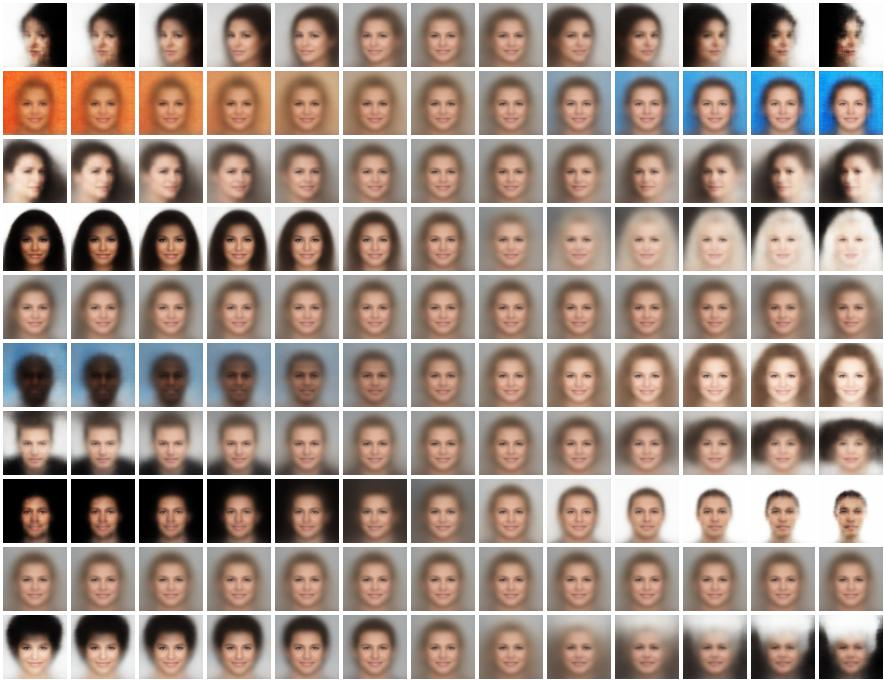
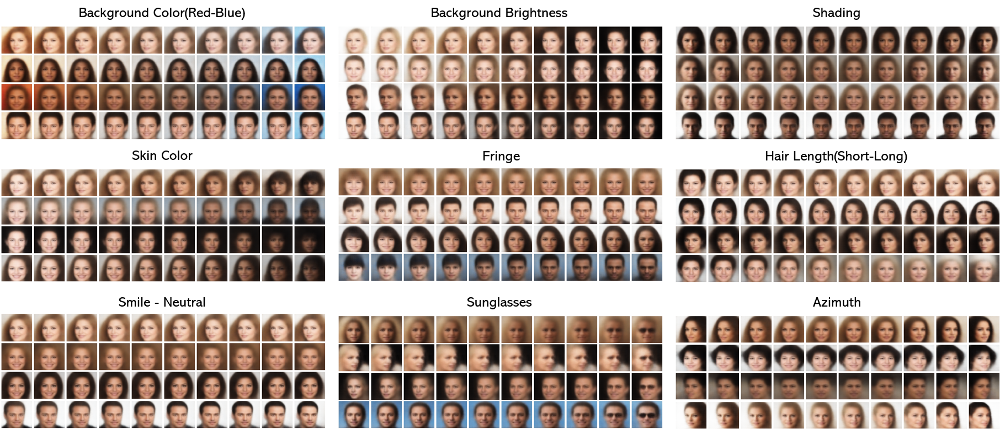
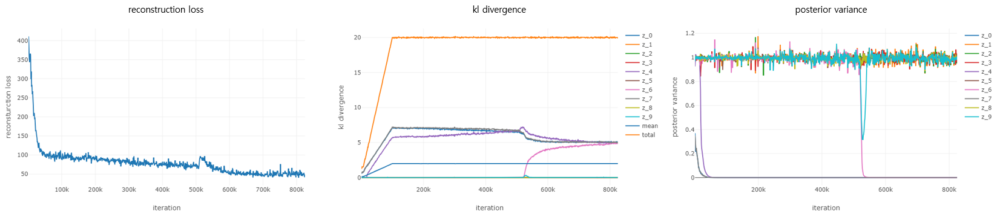

# β-VAE
Github code builds upon [WonKwang Lee and Tony Metger] 

Pytorch reproduction of two papers below:
1. [β-VAE: Learning Basic Visual Concepts with a Constrained Variational Framework, Higgins et al., ICLR, 2017]
2. [Understanding disentangling in β-VAE, Burgess et al., arxiv:1804.03599, 2018]
<br>


## Getting Started 

#### Clone the repository

```bash
git clone https://github.com/lesupermomo/B-VAE.git
```

#### Create a Virtual Environment
Create a virtual environment to isolate your project dependencies.

```bash
python3 -m venv venv
```

#### Activate the Virtual Environment

```source venv/bin/activate```

#### Install the Required Dependencies
Install the necessary libraries by running:

```bash
pip install -r requirements.txt
```


#### Download the Dataset
Run the following command to download the dataset:

```bash
./download_dsprites.sh
```

#### Start a viz session to monitor results

```bash
python -m visdom.server
```
You can then monitor the experiments plots and results at http://localhost:8097/.


#### Run the Experiment
Start running an experiment with the following command:

```bash
./run_dsprites_B_gamma100_z10.sh
```
This will initiate the experiment with the specified parameters.


## Results
#### 3D Chairs
```
sh run_3dchairs_H_beta4_z10.sh
```

```
sh run_3dchairs_H_beta4_z16.sh
```

#### CelebA
```
sh run_celeba_H_beta10_z10.sh
```

```
sh run_celeba_H_beta10_z32.sh
```

#### dSprites
```
sh run_dsprites_B.sh
```
##### visdom line plot


##### latent traversal gif(```--save_output True```)
<p align="center">


</p>

##### reconstruction(left: true, right: reconstruction)

<p align="center">

</p>


### Reference
1. [β-VAE: Learning Basic Visual Concepts with a Constrained Variational Framework, Higgins et al., ICLR, 2017]
2. [Understanding disentangling in β-VAE, Burgess et al., arxiv:1804.03599, 2018]
3. [Github Repo]: Tensorflow implementation from [miyosuda]

[β-VAE: Learning Basic Visual Concepts with a Constrained Variational Framework, Higgins et al., ICLR, 2017]: https://openreview.net/pdf?id=Sy2fzU9gl
[Understanding disentangling in β-VAE, Burgess et al., arxiv:1804.03599, 2018]: http://arxiv.org/abs/1804.03599
[WonKwang Lee and Tony Metger]: https://github.com/1Konny/Beta-VAE?tab=readme-ov-file
[Github Repo]: https://github.com/miyosuda/disentangled_vae
[miyosuda]: https://github.com/miyosuda
